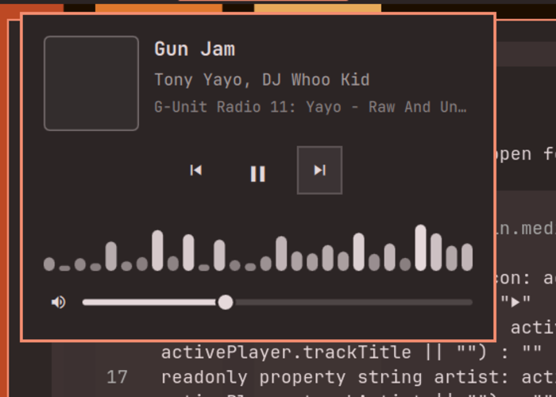

# Media EQ Panel for Omarchy

An MPRIS now-playing bar widget + control panel for Omarchy's Quickshell
desktop. Works with **Spotify** and any player exposing the standard Linux
MPRIS interface. No polling scripts, no `playerctl` dependency — everything
is read live from D-Bus.



Cloned from Omarchy's stock `omarchy.media` widget, with two additions
the stock widget lacks:

- **Player volume slider** in the popup, driving the player's own MPRIS
  volume (independent of system/master volume).
- **Animated 28-bar equalizer** in the popup — purely aesthetic, dances
  while music plays, freezes while paused.

Everything else is stock behavior: scrolling `track · artist` label,
left-click = play/pause, middle-click = next, scroll wheel = prev/next,
right-click = control panel with album art, ⏮ ▶/⏭ buttons, and
multi-source switching when several players are active.

## Requirements

- Omarchy (Quickshell-based shell)
- A player exposing MPRIS (e.g. the Spotify desktop client, open and
  playing — the widget hides when no track metadata is available)
- A Nerd Font (ships with Omarchy) for the control glyphs

## Install

```bash
omarchy plugin add https://github.com/jc-9/omarchy-media-eq.git --enable
```

Enabling replaces the built-in `omarchy.media` widget (same mechanism as
`omarchy plugin clone`). If the widget isn't placed automatically, add it
to the bar:

```bash
omarchy bar move justin.media --section center
```

## Usage

- The widget appears in the bar whenever a player exposes track metadata.
- Hover the label for the full `title — artist` tooltip.
- Right-click the track label to open the panel: playback controls,
  volume slider, and equalizer.

## Configuration

In `BarWidget.qml`:

| Location              | Setting            | Effect                      |
|-----------------------|--------------------|-----------------------------|
| `eqRow` block         | bar count (`28`)   | number of equalizer bars    |
| `eqRow` Timer         | `interval: 130`    | EQ animation speed (ms)     |
| `eqRow`               | `height: ...(36)`  | EQ strip height             |
| volume `PanelSlider`  | `step: 0.05`       | volume slider granularity   |
| root properties       | `maxLabelWidth`    | scrolling label max width   |

The equalizer timer runs only while music is playing **and** the panel is
open, so it costs nothing otherwise.

## Validate

```bash
omarchy plugin validate /path/to/justin.media
```

## Credits

Derived from Omarchy's first-party `omarchy.media` plugin
([basecamp/omarchy](https://github.com/basecamp/omarchy)). Service logic
(`Service.qml`, `MediaModel.js`) is unchanged stock code; the volume
slider follows the `PanelSlider` pattern from Omarchy's audio panel.
